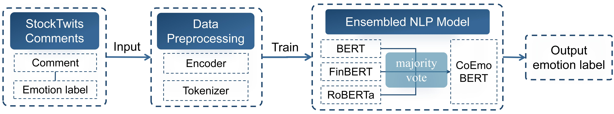
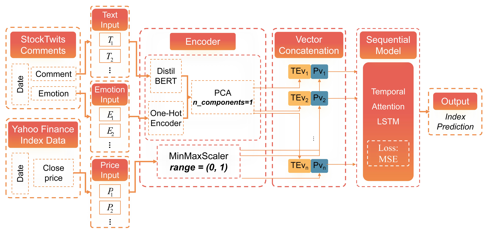

# Improving Stock Index Prediction Based on Financial Sentiment Analysis and Time Series Models

## Abstract
Stock market prediction remains one of the most challenging tasks due to the complex interactions of multiple factors. In this study, we propose a novel stock index prediction method based on financial sentiment analysis and multivariate time series models, to maximize the use of prior information in stock market for better predictive performance. Specifically, a CoEmoBERT model is proposed to achieve better sentiment classification accuracy and f1-score of stock-related tweets on StockEmotions dataset than single language model. Through vector concatenation, we then combine historical stock market index(S\&P 500) data from Yahoo Finance with the sentiment labels and comment texts into a series of vectors as model inputs. Finally, leveraging long short-term memory (LSTM) networks, we achieve stock market index predictions with a mean squared error (MSE) of 0.80 $\times 10^{-3}$.

## Dataset
The dataset used in this study is the StockEmotions dataset, which collected thousands of comments in StockTwits comments annotated with sentiment and emotion labels and S&P 500 index price in Yahoo Finance from December 31, 2019 to January 1, 2021. 

We only use part of the dataset in our research, which is stored in the `data` folder. The whole dataset can be downloaded from [StockEmotions](https://github.com/adlnlp/StockEmotions)

## Sentiment Classification

The code for sentiment classification is in the `code` folder named `classification.py`.

### Result
| **Model**                   | **Emotion Accuracy** | **Emotion F1-score** | **Sentiment Accuracy** | **Sentiment F1-score** |
|-----------------------------|----------------------|----------------------|------------------------|------------------------|
| LogitReg.                   | 0.356                | 0.321                | 0.743                  | 0.743                  |
| NBSVM                       | 0.358                | 0.332                | 0.755                  | 0.756                  |
| BERT                    | 0.420                | 0.398                | 0.763                  | 0.763                  |
| FinBERT                     | 0.411                | 0.397                | 0.769                  | 0.769                  |
| SpanBERT                    | 0.402                | 0.378                | 0.772                  | 0.772                  |
| DistilBERT                  | 0.417                | 0.399                | 0.772                  | 0.772                  |
| RoBERTa                     | 0.419                | 0.407                | 0.799                  | 0.799                  |
| **CoEmoBERT (3 experts)**   | **0.449**            | **0.435**            | **0.815**              | **0.816**              |
| CoEmoBERT (5 experts)       | 0.436                | 0.415                | 0.808                  | 0.809                  |

The best CoEmoBERT model is an ensemble model of three language models: **RoBERTa, FinBERT, and BERT**. The CoEmoBERT model with three experts achieves the best performance in both emotion and sentiment classification.

## Stock Index Prediction

The code for stock index prediction is in the `code` folder named `prediction.py`.

### Result
| **Input Combinations**               | **MSE ($\times 10^{-3}$)** |
|--------------------------------------|----------------------------|
| Index                                | 1.28                       |
| Index + text                         | 1.07                       |
| Index + emo. (GloVe)                 | 0.99                       |
| **Index + emo. (one-hot)**           | **0.83**                   |
| Index + text + emo. (GloVe)          | 1.03                       |
| **Index + text + emo. (one-hot)**    | **0.80**                   |

The best input combination for stock index prediction is the combination of historical stock index data, sentiment labels, and comment texts with **one-hot encoding**. The LSTM model achieves the best performance with a mean squared error of 0.80 $\times 10^{-3}$.

## Acknowledgement
Thanks to the authors of the [StockEmotions](https://github.com/adlnlp/StockEmotions) for providing the processed and labeled dataset.